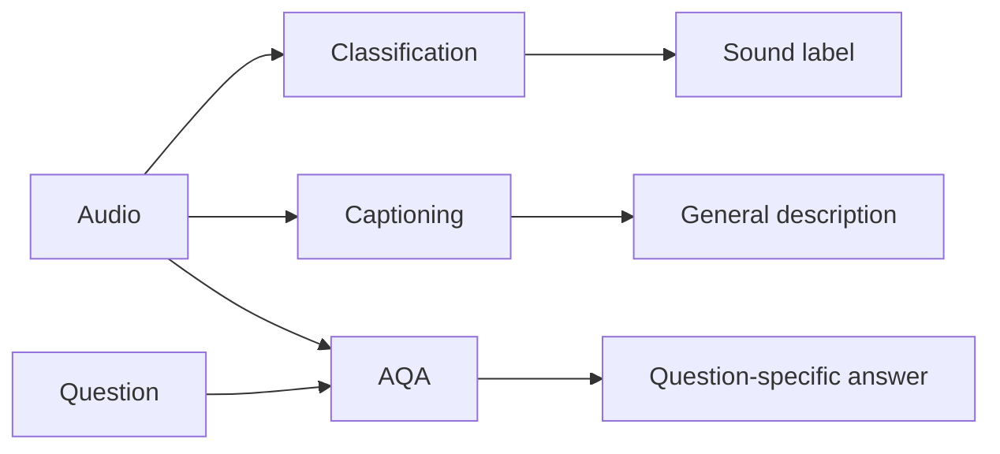
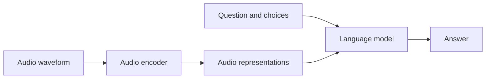

# MD-Audio: First Meeting Notes

**Paper:** [Multi-Domain Audio Question Answering Benchmark Toward Acoustic Content Reasoning](https://arxiv.org/html/2505.07365v2)  
**Purpose:** A speaking reference for the first meeting with Dr. Hamzah  
**Scope:** What AQA is, why MD-Audio was proposed, how AQA works at a high level, and the three benchmark subsets

> **Main message:** MD-Audio is not mainly a new model. It is a structured benchmark for testing what current audio-language models can and cannot understand and reason about.

---

## 1. Start with Audio Question Answering

**Audio Question Answering (AQA)** is a task in which a system receives an audio recording and a natural-language question, then gives a question-specific answer grounded in the audio.

```text
Audio + question → AQA system → answer
```

**Example**

```text
Audio: A dog barks after a door closes.
Question: What happened immediately after the door closed?
Answer: The dog barked.
```

The question determines which part of the recording matters. The same audio can support many different questions.

**Example**

```text
Question 1: Which sounds are present?
Question 2: Which sound occurred first?
Question 3: What may have caused the dog to bark?
```

### AQA is broader than recognition

Recognition asks, **“What sound is present?”** AQA can also ask how sounds relate, when they occur, or what can be inferred from them.

**Example**

```text
Recognition: Audio → “dog barking”
Reasoning: Did the dog bark before or after the car passed?
```

> **Meeting point:** AQA connects sound perception with language understanding and reasoning.

---

## 2. Classification, captioning, and AQA

| Task | Input | Output | What it tests |
|---|---|---|---|
| Audio classification | Audio | Predefined label | Recognizing a sound category |
| Audio captioning | Audio | General description | Summarizing what can be heard |
| Audio question answering | Audio + question | Question-specific answer | Selecting relevant evidence and reasoning about it |

### Classification example

```text
Audio → “crowd cheering”
```

This identifies a category, but it does not explain when the cheering happened or how it relates to other sounds.

### Captioning example

```text
Audio → “A man speaks joyfully while a crowd cheers and music plays.”
```

This gives a general description, but one caption cannot contain every possible detail about the recording.

### AQA example

```text
Question: What might contribute to the man's joyful tone?
Answer: The excited crowd and rhythmic music.
```

The system must identify the relevant sounds, connect them to the speaker's tone, and infer an answer.



> **Meeting point:** The paper is motivated by moving beyond assigning labels toward flexible, question-driven audio understanding.

---

## 3. What is MD-Audio?

**MD-Audio** means **Multi-Domain Audio**. It is an AQA benchmark proposed to test audio understanding and reasoning across different types of recordings.

A **benchmark** is a standardized test containing:

- Audio examples
- Questions and answer choices
- Correct answers
- Separate dataset subsets designed to test different abilities

**Example**

Instead of proposing one new model, the paper evaluates whether existing audio-language models can answer questions about marine animals, environmental timing, and complex real-world scenes.

The benchmark uses a multiple-choice format:

```text
Audio + question + answer choices → one correct option
```

Most questions contain four choices, with exactly one correct answer. Some Complex QA questions contain two or three choices.

**Example**

```text
Question: Which sound occurs first?
A. Dog barking
B. Door closing
C. Keyboard typing
D. Water running

Correct answer: B. Door closing
```

> **Meeting point:** MD-Audio tests different forms of acoustic reasoning using one common AQA format.

---

## 4. What is acoustic reasoning?

**Acoustic content** includes the sounds present and their properties, such as timing, frequency, duration, order, overlap, and background context.

Reasoning means connecting this evidence to answer a question rather than only recognizing a label.

```text
Perception → Relationships → Context → Reasoning → Answer
```

**Example**

```text
Perception: A man is speaking; music and cheering are present.
Relationship: The music and cheering occur during his speech.
Context: The scene appears celebratory.
Reasoning: The crowd and music may contribute to his joyful tone.
```

### External knowledge

Some questions can be answered directly from the audio. Others require external factual knowledge after the sound is recognized.

**Example**

```text
Audio perception: “This sounds like an orca.”
External knowledge: “Orcas may hunt cooperatively.”
Reasoning: Select the answer consistent with both pieces of information.
```

Not every AQA question requires external knowledge.

> **Meeting point:** AQA may combine auditory perception, temporal relationships, contextual interpretation, and external knowledge.

---

## 5. How an audio-language model answers

At a high level, an audio-language model has two important parts:

1. An **audio encoder** converts the waveform into numerical audio representations.
2. A **language model** uses those representations with the question and choices to produce an answer.



**Example**

```text
Audio encoder: detects patterns associated with a marine-mammal vocalization.
Language model: reads the species question and choices.
Combined system: selects the species that best matches the audio.
```

> **Meeting point:** The encoder handles audio information, while the language model connects it to the question and formulates the answer.

---

## 6. The three MD-Audio subsets

| Subset | Audio domain | Main ability |
|---|---|---|
| Bioacoustics QA (BQA) | Marine-mammal vocalizations | Species recognition, acoustic properties, and biological knowledge |
| Temporal Soundscapes QA (TSQA) | Environmental sound events | Onset, offset, order, overlap, and duration |
| Complex QA (CQA) | Natural multi-event recordings | Combining acoustic, temporal, and contextual clues |

The purpose of using three subsets is to reveal different abilities. A model that understands one domain may still fail in another.

**Example**

A model may recognize a whale vocalization correctly but fail to determine when a cupboard sound begins in an environmental recording.

---

## 7. Bioacoustics QA (BQA)

**Bioacoustics** is the study of sounds produced by living organisms. BQA focuses on vocalizations from **31 marine-mammal species**.

It contains approximately:

- 700 training question-answer pairs
- 200 development question-answer pairs

The recordings come from the Watkins Marine Mammal Sound Database.

BQA tests two connected abilities:

1. Identify the species, vocalization, or acoustic properties.
2. Use the perceived event to answer a factual or comparative question.

**Recognition example**

```text
Question: Which species most likely produced this vocalization?
```

**Knowledge example**

```text
First identify the species from its sound.
Then answer a question about its habitat or behavior.
```

The recordings vary greatly in duration, sample rate, and recording conditions, making the domain challenging.

> **Meeting point:** BQA combines specialized sound perception with acoustic or biological knowledge.

---

## 8. Temporal Soundscapes QA (TSQA)

A **sound event** is one identifiable acoustic occurrence, such as barking, footsteps, speech, or running water.

A **soundscape** is the entire acoustic scene containing one or more sound events, possibly at different or overlapping times.

**Example**

```text
Sound events: speech, water, cupboard closing, and dog barking
Soundscape: the complete ten-second kitchen recording containing them
```

TSQA contains approximately:

- 1,000 training question-answer pairs
- 600 development question-answer pairs
- 26 environmental sound classes

The clips are ten seconds long and were manually verified. The audio comes from NIGENS, L3DAS23, and TAU Urban Sound 2019.

### Essential temporal terms

- **Onset:** when an event starts
- **Offset:** when an event ends
- **Duration:** offset minus onset
- **Order:** which event happens first or next
- **Overlap:** two events happening at the same time

**Example**

```text
Dog onset:  2.1 seconds
Dog offset: 5.4 seconds
Duration:   5.4 − 2.1 = 3.3 seconds
```

**Order example**

```text
Door → Footsteps → Dog

Question: Which sound occurred immediately after the door?
Answer: Footsteps.
```

**Overlap example**

```text
Speech:   |----------------|
Water:        |-------|

Question: Which sound overlaps with the water?
Answer: Speech.
```

> **Meeting point:** TSQA asks mainly, “What happened when?”

---

## 9. Complex QA (CQA)

CQA uses natural recordings containing multiple events and broader context. It is the largest subset, containing approximately:

- 6,400 training question-answer pairs
- 1,600 development question-answer pairs

Its audio comes from AudioSet and Mira.

CQA may require the model to:

- Identify several sounds
- Understand their order or overlap
- Connect different acoustic clues
- Interpret the overall situation
- Infer an answer that is not a simple sound label or timestamp

**Example**

```text
Audio: A man speaks joyfully while a crowd cheers and music plays.
Question: What likely contributes to the man's joyful tone?
Answer: The celebratory crowd and rhythmic music.
```

A useful way to describe the process is:

```text
Level 1 — Perception: What sounds exist?
Level 2 — Relationships: How do the sounds relate?
Level 3 — Context: What situation do they represent?
Level 4 — Reasoning: What can be inferred to answer the question?
```

> **Meeting point:** CQA asks, “What is happening, how are the clues related, and what can we infer from them?”

---

## 10. TSQA versus CQA

| Temporal Soundscapes QA | Complex QA |
|---|---|
| Focuses on precise temporal structure | Focuses on broader multi-event understanding |
| Asks about onset, offset, order, duration, and overlap | Combines temporal, acoustic, and contextual clues |
| Often has a directly measurable answer | May require higher-level inference |

**Example**

```text
TSQA: When did the cheering begin?
CQA: What does the cheering suggest about the situation?
```

> **Meeting point:** Temporal reasoning can be part of CQA, but CQA is broader than temporal reasoning alone.

---

## 11. Short closing summary

> Audio Question Answering goes beyond recognizing a sound. It uses a question to determine which acoustic evidence matters and may require temporal, contextual, or knowledge-based reasoning. The MD-Audio paper introduces a benchmark—not a new model—with three complementary subsets: Bioacoustics QA for marine sounds and related knowledge, Temporal Soundscapes QA for event timing, and Complex QA for multi-event contextual reasoning.

## One-line memory aid

```text
BQA = Who or what made the sound?
TSQA = What happened when?
CQA = What is happening, how is it connected, and what can we infer?
```

